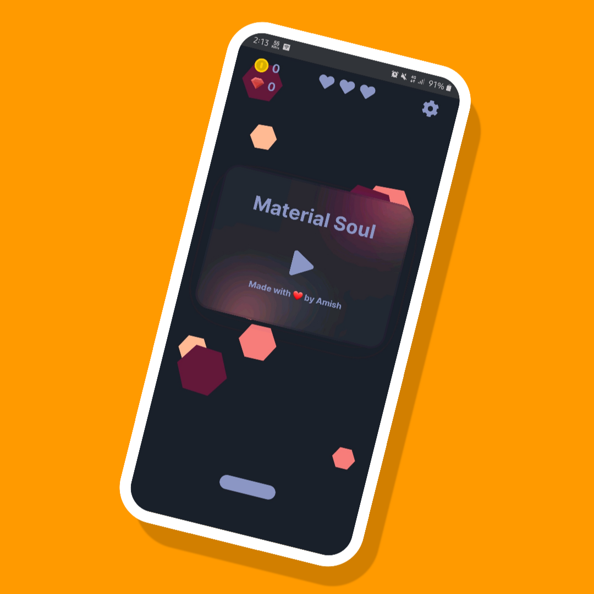
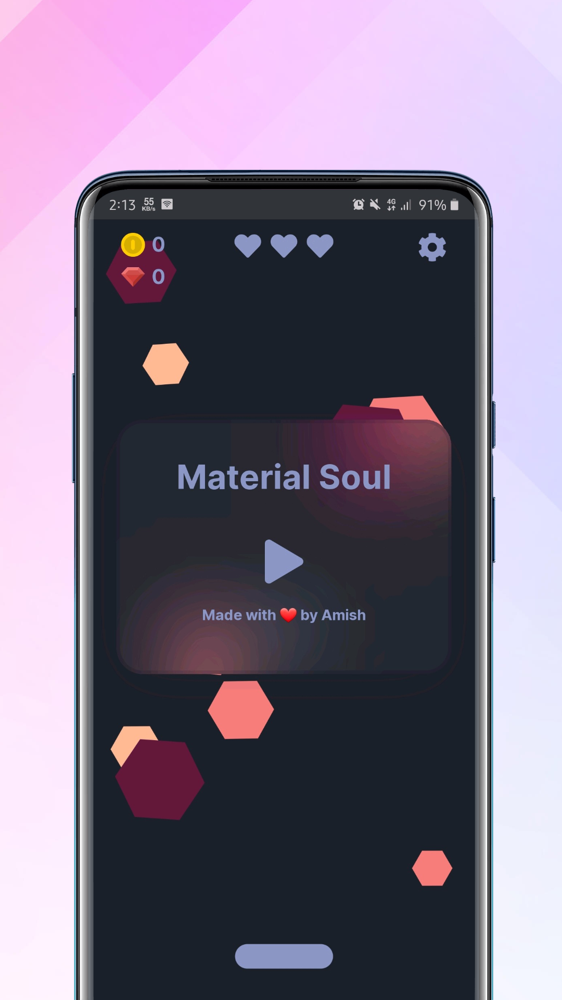
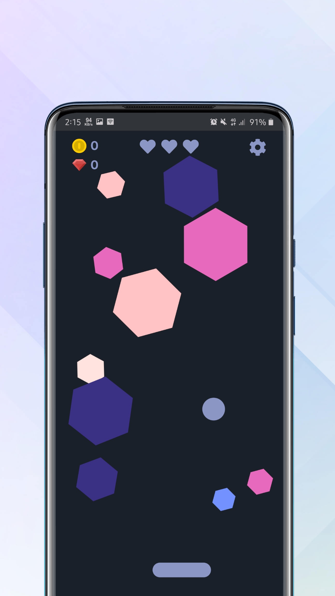
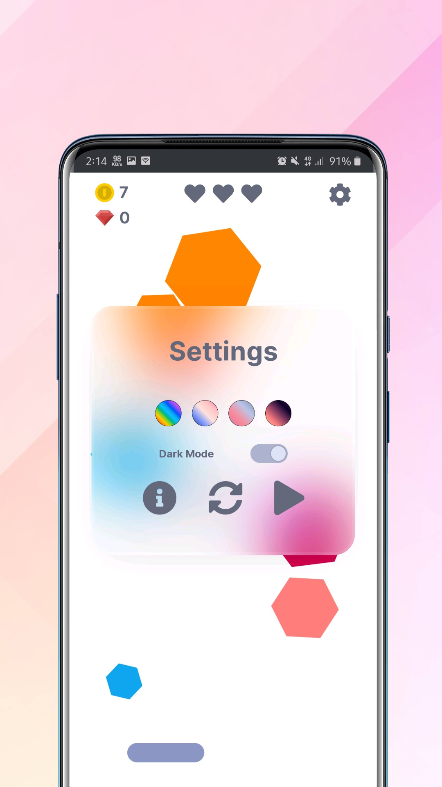
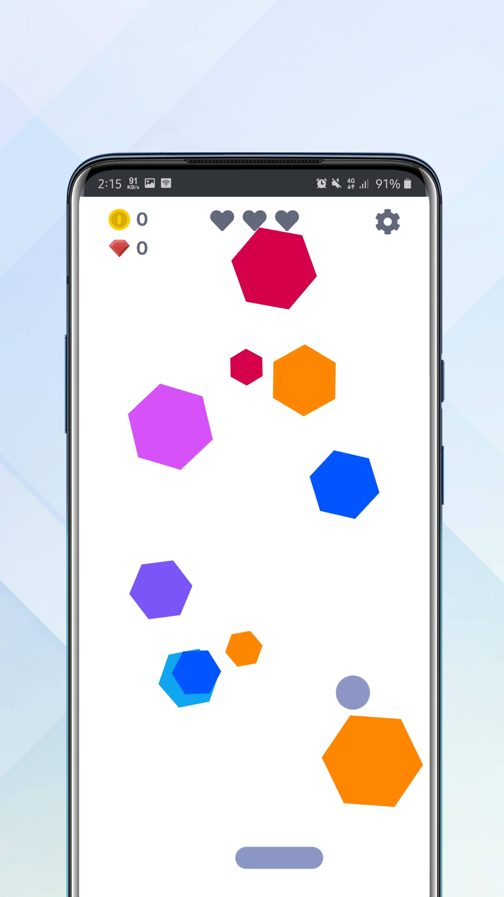
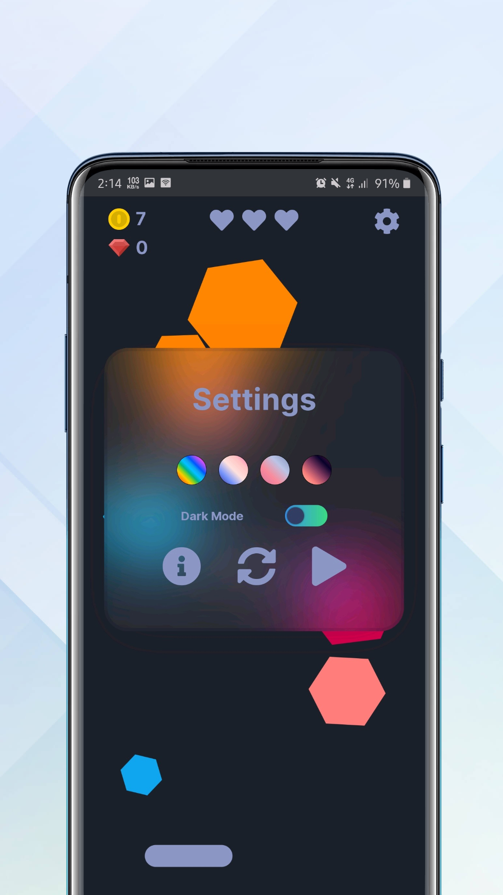
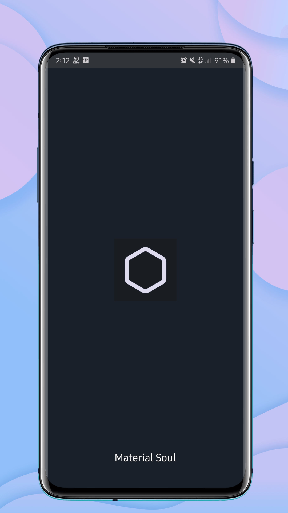

  

<h1 align="center">Material Soul</h1>

 A simple minimalist in-browser web app
      

---

## 🌱What does it do?

- 💻 **Material Soul** is a minimal bricks breaker like game.

- 🌱It is created using **Javascript** and **p5.js**(framework)

- 💬 Ping me about **Anything**, I'm glad to help you!😇

- ⚡ Fun fact: It is created in mobile code editor and in-browser IDE of p5.js.

---

## 🏁 Getting Started 

- First thing first, open the https://amishranpariya.github.io/MaterialSoul/ in any of your favourite browser.

- Now, Hit on the play button and break all the records!

<!---->

- Fun tip: Click settings to change the themes and mode. Choose your favourite.😇

---
## ⛏️ Built Using

- [p5.js](https://p5js.org/) - Framework

- [p5.js](https://editor.p5js.org/) - editor
 
 ---
## 🎉 Acknowledgements 

- Inspired by [@yining1023](https://github.com/yining1023) 

- Visit to see her [Game](https://yining1023.github.io/brickBreaker/) & [Tutorial](https://youtu.be/5kEPixL8JoU )

---

#### Show some ❤️ by starring some of the repositories!

---
